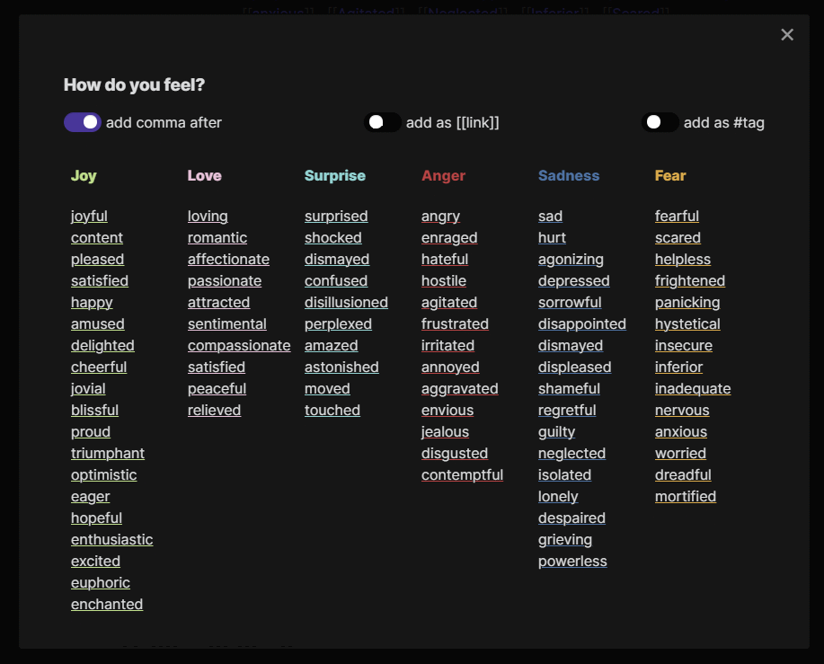

## Obsidian Emotion Picker

Paste an emotion / feeling into note, using convenient list of emotions, divided into six categories:

-   Joy
-   Love
-   Surprise
-   Anger
-   Sadness
-   Fear

Click on an emotion to insert it as text at the current cursor position.

The primary purpose is to provide an easier way to add entries to daily journal, emotions / mood tracker, etc.
