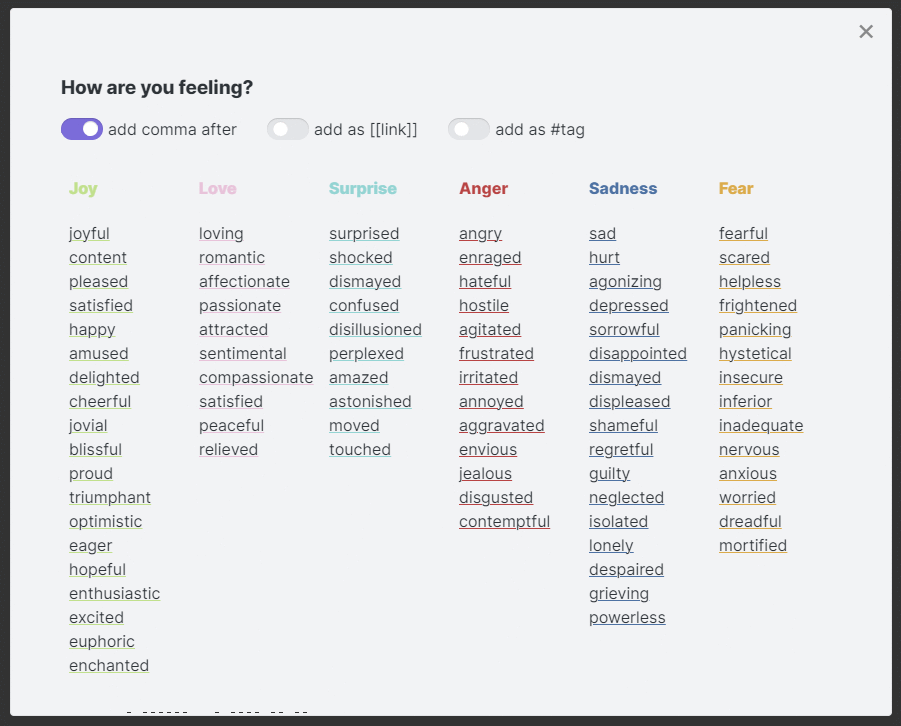

## Obsidian Emotion Picker

Paste an emotion / feeling into note, using customizable list of emotions (or sensible default one).

Click on an emotion to insert it as text at the current cursor position.

Available options (default values can be set in Settings tab):

-   add comma after (convenient if entering more than one emotion)
-   insert as [[link]]
-   insert as #tag
-   capitalize wort

The primary purpose is to provide an easier way to add entries to daily journal, emotions / mood tracker, etc.
